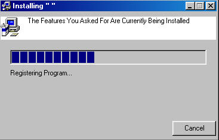



## Installer

### Description

This Will Create A New Directory For Your Program Add Regitstry Keys And It Looks Very Professional Unfortunately It Does Not Copy The Installation Files Yot That's Version 2
 
### More Info
 
Not That I Know Of

             |
---                |---
**Submitted On**   |1998-06-18 00:00:00
**By**             |[UK\_DEV2003](https://github.com/Planet-Source-Code/PSCIndex/blob/master/ByAuthor/uk-dev2003.md)
**Level**          |Intermediate
**User Rating**    |3.0 (6 globes from 2 users)
**Compatibility**  |VB 5\.0, VB 6\.0
**Category**       |[Complete Applications](https://github.com/Planet-Source-Code/PSCIndex/blob/master/ByCategory/complete-applications__1-27.md)
**World**          |[Visual Basic](https://github.com/Planet-Source-Code/PSCIndex/blob/master/ByWorld/visual-basic.md)
**Archive File**   |[Installer159826682003\.zip](https://github.com/Planet-Source-Code/uk-dev2003-installer__1-46042/archive/master.zip)

